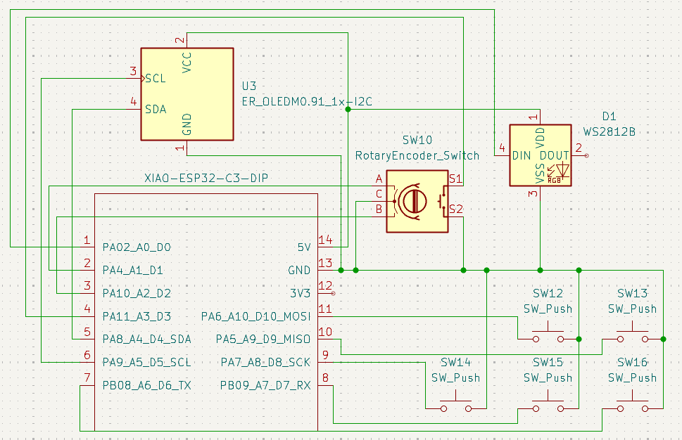

# TapPad
TapPad speeds up annoying tasks. You can use the keys to assign custom macros on your device or use the rotary switch to control media. It also has a customizable 0.91 inch OLED display and a LED indicator.

# PCB Design 
The PCB was made on Kicad. It connects all 5 switches, rotory encoder switch, LED and the OLED display, to the Seeduino board. 
Schematic and PCB layout is as follows - 

# 3D Case design 
Case designed on fusion for the pcb having 5 switches, one rotary encoder, an OLED display and the LED indicator with a USB-C port on the right side. 

# Firmware
The firmware is made via QMK. It assigns the function keys from F13 to F17 to the 5 switches and lets you control media and volume through the rotary encoder. 
[Update Display](https://github.com/Yash-Takhtani/TapPad/blob/main/Update%20display.py) can be used to set text on the display.
